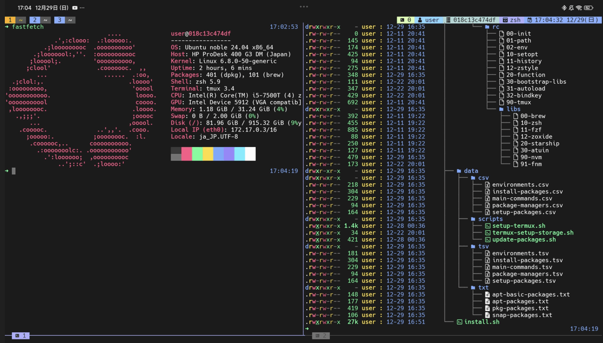

# dotfiles

Welcome to my dotfiles.



## Installation

```sh
git clone https://github.com/nao10i/dotfiles
cd dotfiles
./install.sh all [apt|brew|snap|pkg]
```

## Supported OS

- Ubuntu 22.04-
- Latest Termux (Android)

## Environment to be set up

| Type                 | System/Software     |
| -------------------- | ------------------- |
| Shell                | zsh                 |
| Prompt               | starship.rs         |
| Editor               | Neovim + LazyVim    |
| Terminal multiplexer | tmux, zellij        |
| TUI Filer            | broot, yazi         |
| Terminal emulator    | alacritty, termux   |

## Docker

You can build and enter a container with the following commands.

```sh
docker build -t dotfiles-img .
docker run -it -d --name dotfiles-con dotfiles-img
docker exec -it dotfiles-con /bin/zsh
```

In container, install apt packages

```sh
cd dotfiles
./install all apt
```

or install Homebrew with following command. (USERNAME/PASSWORD: user/user)

```sh
cd dotfiles
./install all brew
```

## Keymaps
### tmux prefix_key = ctrl+\
| Key           | Description                   |
| ------------- | ------------------------------|
| I             | install tmux plugins with tpm |
| Ctrl+s        | save tmux env                 |
| Ctrl+r        | restore tmux env              |
| e             | switch pane-synchronize mode  |

### tmux alt key shortcut
| Key       | Description                     | Prefix key     |
| --------- | ------------------------------- | -------------- |
| Alt+(←/→) | switch to previous/next window  | p              |
| Alt+(↑/↓) | create/delete window            | c              |
| Alt+-     | split window horizontally       | -              |
| Alt+\     | split window vertically         | \              |
| Alt+[1-9] | switch to 1-9 window            | [1-9]          |

### tmux alt+shift key shortcut
| Key             | Description                     | Prefix key     |
| --------------- | ------------------------------- | -------------- |
| Alt+Shift+(←/→) | switch to previous/next session | p              |
| Alt+Shift+(↑/↓) | create/delete session           | c              |